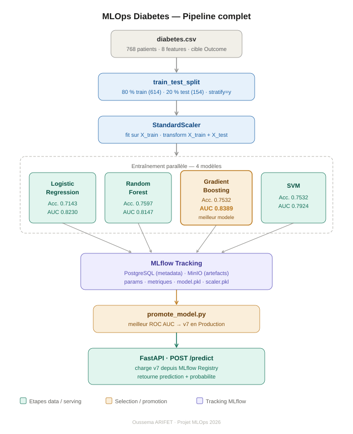

# mlops
# MLOps Diabetes Prediction

Pipeline MLOps complet de prédiction du diabète : chargement des données, entraînement de 4 modèles, tracking avec MLflow, sélection automatique du meilleur modèle et serving via une API REST FastAPI.

---

## Vue d'ensemble

Ce projet implémente un pipeline de bout en bout à partir du dataset Pima Indians Diabetes (768 patients, 8 features cliniques). L'idée est simple : entraîner plusieurs modèles, garder le meilleur automatiquement, et l'exposer via une API prête à l'emploi.

Le pipeline fait tout ça :

- Charger et préparer les données avec Pandas et Scikit-learn
- Entraîner 4 modèles de classification en parallèle
- Logger chaque expérience dans MLflow avec ses métriques et artefacts
- Stocker les modèles dans MinIO (compatible S3)
- Sélectionner automatiquement le meilleur modèle selon le ROC AUC
- Le promouvoir en Production dans le Model Registry
- Exposer les prédictions via FastAPI
- Containeriser toute l'infrastructure avec Docker Compose



---

## Architecture

L'infrastructure tourne entièrement dans Docker Compose avec quatre services :

- **PostgreSQL** (port 5432) — stocke les métadonnées MLflow
- **MinIO** (port 9000) — stocke les artefacts et modèles sérialisés
- **MLflow** (port 5000) — interface de tracking et Model Registry
- **FastAPI** (port 8000) — sert les prédictions en production

---

## Prérequis

- Python 3.10+
- Docker 20.10+ et Docker Compose 2.0+
- pip 23.0+
- 4 Go de RAM minimum, 10 Go de disque

---

## Installation

Cloner le projet et créer l'environnement virtuel :

```bash
git clone https://github.com/votre-utilisateur/projet9-mlops.git
cd projet9-mlops

python3 -m venv projet9-env
source projet9-env/bin/activate
pip install -r requirements.txt
```

Démarrer l'infrastructure :

```bash
docker compose up -d
docker compose ps
```

Tous les services doivent apparaître en état `Up (healthy)`.

---

## Utilisation

### 1. Variables d'environnement

```bash
export MLFLOW_TRACKING_URI=http://localhost:5000
export MLFLOW_S3_ENDPOINT_URL=http://localhost:9000
export AWS_ACCESS_KEY_ID=minioadmin
export AWS_SECRET_ACCESS_KEY=minioadmin123
```

### 2. Entraîner les modèles

```bash
python3 spark-training/train.py
```

Le script charge les données, entraîne les 4 modèles et affiche les résultats :

```
Train : 614 lignes  |  Test : 154 lignes

LogisticRegression   → Accuracy: 0.7143  ROC AUC: 0.8230
RandomForest         → Accuracy: 0.7597  ROC AUC: 0.8147
GradientBoosting     → Accuracy: 0.7532  ROC AUC: 0.8389
SVM                  → Accuracy: 0.7532  ROC AUC: 0.7924
```

### 3. Promouvoir le meilleur modèle

```bash
python3 spark-training/promote_model.py
```

```
Meilleur modèle : v7 (GradientBoosting) — ROC AUC : 0.8389
Version 7 promue en Production.
```

### 4. Vérifier que l'API est prête

```bash
curl http://localhost:8000/ready
```

```json
{
  "status": "ready",
  "model_loaded": true,
  "model_name": "diabetes_model",
  "model_version": "7"
}
```

### 5. Faire une prédiction

```bash
curl -X POST http://localhost:8000/api/v1/predict \
  -H "Content-Type: application/json" \
  -d '{
    "pregnancies": 8,
    "glucose": 183.0,
    "blood_pressure": 64.0,
    "skin_thickness": 0.0,
    "insulin": 0.0,
    "bmi": 23.3,
    "diabetes_pedigree": 0.672,
    "age": 32
  }'
```

```json
{
  "prediction": 1,
  "class_name": "diabétique",
  "probability_diabetic": 0.7772,
  "probability_healthy": 0.2228,
  "risk_level": "Élevé",
  "model_version": "7"
}
```

---

## Pipeline de données

| Étape | Outil | Description |
|-------|-------|-------------|
| Chargement | `pd.read_csv()` | Lecture du CSV (768 patients) |
| Séparation | `train_test_split` | 80 % train / 20 % test avec stratification |
| Normalisation | `StandardScaler` | Moyenne = 0, écart-type = 1 par feature |

### Features utilisées

| Feature | Description | Unité |
|---------|-------------|-------|
| `Pregnancies` | Nombre de grossesses | — |
| `Glucose` | Concentration en glucose | mg/dL |
| `BloodPressure` | Pression artérielle diastolique | mmHg |
| `SkinThickness` | Épaisseur du pli cutané | mm |
| `Insulin` | Taux d'insuline sérique | µU/mL |
| `BMI` | Indice de masse corporelle | kg/m² |
| `DiabetesPedigreeFunction` | Score d'antécédents familiaux | — |
| `Age` | Âge de la patiente | années |

---

## Résultats des modèles

| Modèle | Version MLflow | Accuracy | F1 Score | ROC AUC |
|--------|---------------|----------|----------|---------|
| LogisticRegression | v5 | 0.7143 | 0.6234 | 0.8230 |
| RandomForest | v6 | 0.7597 | 0.6789 | 0.8147 |
| **GradientBoosting** | **v7** | **0.7532** | **0.6701** | **0.8389** |
| SVM | v8 | 0.7532 | 0.6701 | 0.7924 |

GradientBoosting v7 est sélectionné automatiquement car il obtient le meilleur ROC AUC (0.8389).

Paramètres du modèle retenu :

| Paramètre | Valeur |
|-----------|--------|
| Algorithme | GradientBoostingClassifier |
| n_estimators | 100 |
| learning_rate | 0.1 |
| max_depth | 3 |
| random_state | 42 |

---

## API REST

Base URL : `http://localhost:8000`

| Méthode | Endpoint | Description |
|---------|----------|-------------|
| GET | `/health` | Health check du service |
| GET | `/ready` | Vérifie que le modèle est chargé |
| POST | `/api/v1/predict` | Prédiction pour un patient |
| POST | `/api/v1/predict/batch` | Prédiction pour plusieurs patients |

Les niveaux de risque retournés sont calculés à partir de la probabilité :

| Niveau | Probabilité diabétique |
|--------|----------------------|
| Faible | < 30 % |
| Modéré | entre 30 % et 60 % |
| Élevé | > 60 % |

---

## Interfaces disponibles

| Interface | URL | Identifiants |
|-----------|-----|-------------|
| API REST | http://localhost:8000 | — |
| Swagger UI | http://localhost:8000/docs | — |
| MLflow UI | http://localhost:5000 | — |
| MinIO Console | http://localhost:9001 | minioadmin / minioadmin123 |

---

## Structure du projet

```
projet9-mlops/
├── data/
│   └── raw/
│       └── diabetes.csv
├── spark-training/
│   ├── train.py
│   └── promote_model.py
├── api-serving/
│   └── app/
│       ├── main.py
│       ├── routes/
│       │   ├── predict.py
│       │   └── health.py
│       └── services/
│           └── mlflow_service.py
├── docker-compose.yml
├── requirements.txt
└── README.md
```

---

## Technologies

| Technologie | Version | Rôle |
|-------------|---------|------|
| Python | 3.10 | Langage principal |
| Scikit-learn | 1.3+ | Entraînement des modèles |
| Pandas | 2.0+ | Manipulation des données |
| MLflow | 2.11 | Tracking et Model Registry |
| FastAPI | 0.100+ | API REST |
| PostgreSQL | 15 | Métadonnées MLflow |
| MinIO | Latest | Stockage des artefacts |
| Docker Compose | 2.0+ | Containerisation |

---

## Auteur

Oussema ARIFET — Projet MLOps 2026

## Licence

MIT